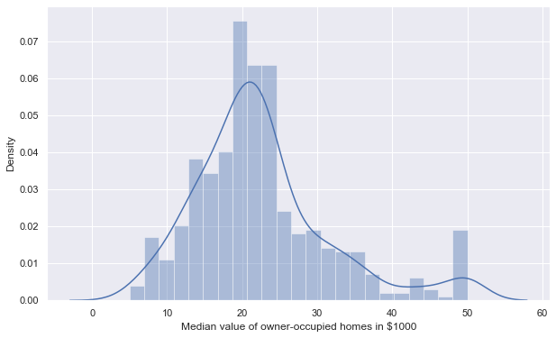
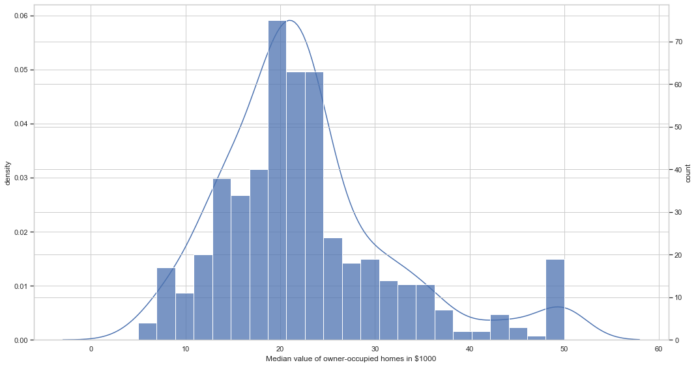
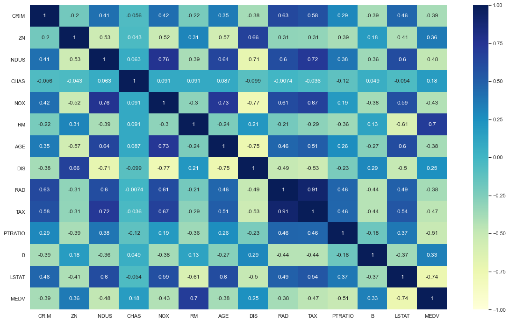
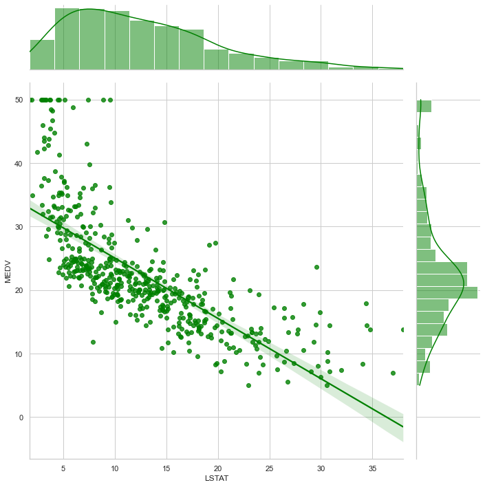
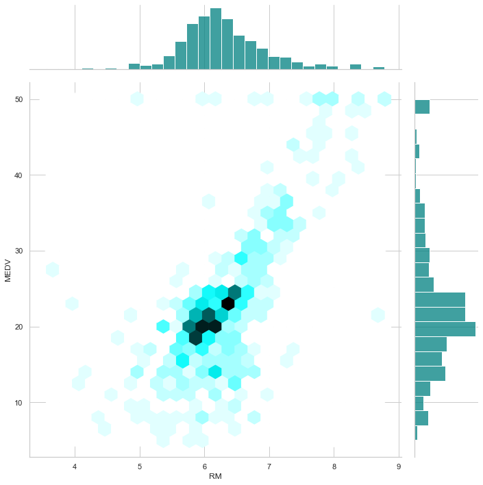

```python
# Importing libraries
import numpy as np
import pandas as pd

import matplotlib.pyplot as plt
import seaborn as sns
%matplotlib inline
```


```python
# Loading dataset
from sklearn.datasets import load_boston
housing = load_boston()
print(housing.keys())
```

    dict_keys(['data', 'target', 'feature_names', 'DESCR', 'filename'])


```python
print (housing.DESCR)
```

    .. _boston_dataset:
    
    Boston house prices dataset
    ---------------------------
    
    **Data Set Characteristics:**  
    
        :Number of Instances: 506 
    
        :Number of Attributes: 13 numeric/categorical predictive. Median Value (attribute 14) is usually the target.
    
        :Attribute Information (in order):
            - CRIM     per capita crime rate by town
            - ZN       proportion of residential land zoned for lots over 25,000 sq.ft.
            - INDUS    proportion of non-retail business acres per town
            - CHAS     Charles River dummy variable (= 1 if tract bounds river; 0 otherwise)
            - NOX      nitric oxides concentration (parts per 10 million)
            - RM       average number of rooms per dwelling
            - AGE      proportion of owner-occupied units built prior to 1940
            - DIS      weighted distances to five Boston employment centres
            - RAD      index of accessibility to radial highways
            - TAX      full-value property-tax rate per $10,000
            - PTRATIO  pupil-teacher ratio by town
            - B        1000(Bk - 0.63)^2 where Bk is the proportion of blacks by town
            - LSTAT    % lower status of the population
            - MEDV     Median value of owner-occupied homes in $1000's
    
        :Missing Attribute Values: None
    
        :Creator: Harrison, D. and Rubinfeld, D.L.
    
    This is a copy of UCI ML housing dataset.
    https://archive.ics.uci.edu/ml/machine-learning-databases/housing/
    
    
    This dataset was taken from the StatLib library which is maintained at Carnegie Mellon University.
    
    The Boston house-price data of Harrison, D. and Rubinfeld, D.L. 'Hedonic
    prices and the demand for clean air', J. Environ. Economics & Management,
    vol.5, 81-102, 1978.   Used in Belsley, Kuh & Welsch, 'Regression diagnostics
    ...', Wiley, 1980.   N.B. Various transformations are used in the table on
    pages 244-261 of the latter.
    
    The Boston house-price data has been used in many machine learning papers that address regression
    problems.   
         
    .. topic:: References
    
       - Belsley, Kuh & Welsch, 'Regression diagnostics: Identifying Influential Data and Sources of Collinearity', Wiley, 1980. 244-261.
       - Quinlan,R. (1993). Combining Instance-Based and Model-Based Learning. In Proceedings on the Tenth International Conference of Machine Learning, 236-243, University of Massachusetts, Amherst. Morgan Kaufmann.
    


```python
# Creating dataframe with features
housing_df = pd.DataFrame(housing.data, columns = housing.feature_names)
```


```python
# Adding target variable to the dataset
housing_df['MEDV'] = housing.target
```


```python
housing_df.head()
```


<div>
<style scoped>
    .dataframe tbody tr th:only-of-type {
        vertical-align: middle;
    }

    .dataframe tbody tr th {
        vertical-align: top;
    }

    .dataframe thead th {
        text-align: right;
    }
</style>
<table border="1" class="dataframe">
  <thead>
    <tr style="text-align: right;">
      <th></th>
      <th>CRIM</th>
      <th>ZN</th>
      <th>INDUS</th>
      <th>CHAS</th>
      <th>NOX</th>
      <th>RM</th>
      <th>AGE</th>
      <th>DIS</th>
      <th>RAD</th>
      <th>TAX</th>
      <th>PTRATIO</th>
      <th>B</th>
      <th>LSTAT</th>
      <th>MEDV</th>
    </tr>
  </thead>
  <tbody>
    <tr>
      <th>0</th>
      <td>0.00632</td>
      <td>18.0</td>
      <td>2.31</td>
      <td>0.0</td>
      <td>0.538</td>
      <td>6.575</td>
      <td>65.2</td>
      <td>4.0900</td>
      <td>1.0</td>
      <td>296.0</td>
      <td>15.3</td>
      <td>396.90</td>
      <td>4.98</td>
      <td>24.0</td>
    </tr>
    <tr>
      <th>1</th>
      <td>0.02731</td>
      <td>0.0</td>
      <td>7.07</td>
      <td>0.0</td>
      <td>0.469</td>
      <td>6.421</td>
      <td>78.9</td>
      <td>4.9671</td>
      <td>2.0</td>
      <td>242.0</td>
      <td>17.8</td>
      <td>396.90</td>
      <td>9.14</td>
      <td>21.6</td>
    </tr>
    <tr>
      <th>2</th>
      <td>0.02729</td>
      <td>0.0</td>
      <td>7.07</td>
      <td>0.0</td>
      <td>0.469</td>
      <td>7.185</td>
      <td>61.1</td>
      <td>4.9671</td>
      <td>2.0</td>
      <td>242.0</td>
      <td>17.8</td>
      <td>392.83</td>
      <td>4.03</td>
      <td>34.7</td>
    </tr>
    <tr>
      <th>3</th>
      <td>0.03237</td>
      <td>0.0</td>
      <td>2.18</td>
      <td>0.0</td>
      <td>0.458</td>
      <td>6.998</td>
      <td>45.8</td>
      <td>6.0622</td>
      <td>3.0</td>
      <td>222.0</td>
      <td>18.7</td>
      <td>394.63</td>
      <td>2.94</td>
      <td>33.4</td>
    </tr>
    <tr>
      <th>4</th>
      <td>0.06905</td>
      <td>0.0</td>
      <td>2.18</td>
      <td>0.0</td>
      <td>0.458</td>
      <td>7.147</td>
      <td>54.2</td>
      <td>6.0622</td>
      <td>3.0</td>
      <td>222.0</td>
      <td>18.7</td>
      <td>396.90</td>
      <td>5.33</td>
      <td>36.2</td>
    </tr>
  </tbody>
</table>
</div>


```python
housing_df.info()
```

    <class 'pandas.core.frame.DataFrame'>
    RangeIndex: 506 entries, 0 to 505
    Data columns (total 14 columns):
     #   Column   Non-Null Count  Dtype  
    ---  ------   --------------  -----  
     0   CRIM     506 non-null    float64
     1   ZN       506 non-null    float64
     2   INDUS    506 non-null    float64
     3   CHAS     506 non-null    float64
     4   NOX      506 non-null    float64
     5   RM       506 non-null    float64
     6   AGE      506 non-null    float64
     7   DIS      506 non-null    float64
     8   RAD      506 non-null    float64
     9   TAX      506 non-null    float64
     10  PTRATIO  506 non-null    float64
     11  B        506 non-null    float64
     12  LSTAT    506 non-null    float64
     13  MEDV     506 non-null    float64
    dtypes: float64(14)
    memory usage: 55.5 KB


```python
housing_df.describe()
```


<div>
<style scoped>
    .dataframe tbody tr th:only-of-type {
        vertical-align: middle;
    }

    .dataframe tbody tr th {
        vertical-align: top;
    }

    .dataframe thead th {
        text-align: right;
    }
</style>
<table border="1" class="dataframe">
  <thead>
    <tr style="text-align: right;">
      <th></th>
      <th>CRIM</th>
      <th>ZN</th>
      <th>INDUS</th>
      <th>CHAS</th>
      <th>NOX</th>
      <th>RM</th>
      <th>AGE</th>
      <th>DIS</th>
      <th>RAD</th>
      <th>TAX</th>
      <th>PTRATIO</th>
      <th>B</th>
      <th>LSTAT</th>
      <th>MEDV</th>
    </tr>
  </thead>
  <tbody>
    <tr>
      <th>count</th>
      <td>506.000000</td>
      <td>506.000000</td>
      <td>506.000000</td>
      <td>506.000000</td>
      <td>506.000000</td>
      <td>506.000000</td>
      <td>506.000000</td>
      <td>506.000000</td>
      <td>506.000000</td>
      <td>506.000000</td>
      <td>506.000000</td>
      <td>506.000000</td>
      <td>506.000000</td>
      <td>506.000000</td>
    </tr>
    <tr>
      <th>mean</th>
      <td>3.613524</td>
      <td>11.363636</td>
      <td>11.136779</td>
      <td>0.069170</td>
      <td>0.554695</td>
      <td>6.284634</td>
      <td>68.574901</td>
      <td>3.795043</td>
      <td>9.549407</td>
      <td>408.237154</td>
      <td>18.455534</td>
      <td>356.674032</td>
      <td>12.653063</td>
      <td>22.532806</td>
    </tr>
    <tr>
      <th>std</th>
      <td>8.601545</td>
      <td>23.322453</td>
      <td>6.860353</td>
      <td>0.253994</td>
      <td>0.115878</td>
      <td>0.702617</td>
      <td>28.148861</td>
      <td>2.105710</td>
      <td>8.707259</td>
      <td>168.537116</td>
      <td>2.164946</td>
      <td>91.294864</td>
      <td>7.141062</td>
      <td>9.197104</td>
    </tr>
    <tr>
      <th>min</th>
      <td>0.006320</td>
      <td>0.000000</td>
      <td>0.460000</td>
      <td>0.000000</td>
      <td>0.385000</td>
      <td>3.561000</td>
      <td>2.900000</td>
      <td>1.129600</td>
      <td>1.000000</td>
      <td>187.000000</td>
      <td>12.600000</td>
      <td>0.320000</td>
      <td>1.730000</td>
      <td>5.000000</td>
    </tr>
    <tr>
      <th>25%</th>
      <td>0.082045</td>
      <td>0.000000</td>
      <td>5.190000</td>
      <td>0.000000</td>
      <td>0.449000</td>
      <td>5.885500</td>
      <td>45.025000</td>
      <td>2.100175</td>
      <td>4.000000</td>
      <td>279.000000</td>
      <td>17.400000</td>
      <td>375.377500</td>
      <td>6.950000</td>
      <td>17.025000</td>
    </tr>
    <tr>
      <th>50%</th>
      <td>0.256510</td>
      <td>0.000000</td>
      <td>9.690000</td>
      <td>0.000000</td>
      <td>0.538000</td>
      <td>6.208500</td>
      <td>77.500000</td>
      <td>3.207450</td>
      <td>5.000000</td>
      <td>330.000000</td>
      <td>19.050000</td>
      <td>391.440000</td>
      <td>11.360000</td>
      <td>21.200000</td>
    </tr>
    <tr>
      <th>75%</th>
      <td>3.677083</td>
      <td>12.500000</td>
      <td>18.100000</td>
      <td>0.000000</td>
      <td>0.624000</td>
      <td>6.623500</td>
      <td>94.075000</td>
      <td>5.188425</td>
      <td>24.000000</td>
      <td>666.000000</td>
      <td>20.200000</td>
      <td>396.225000</td>
      <td>16.955000</td>
      <td>25.000000</td>
    </tr>
    <tr>
      <th>max</th>
      <td>88.976200</td>
      <td>100.000000</td>
      <td>27.740000</td>
      <td>1.000000</td>
      <td>0.871000</td>
      <td>8.780000</td>
      <td>100.000000</td>
      <td>12.126500</td>
      <td>24.000000</td>
      <td>711.000000</td>
      <td>22.000000</td>
      <td>396.900000</td>
      <td>37.970000</td>
      <td>50.000000</td>
    </tr>
  </tbody>
</table>
</div>


## What's the price distribution of the housing?


```python
sns.set_theme(style="darkgrid")
plt.figure (figsize=(10,6))
sns.distplot(housing_df['MEDV'], axlabel = 'Median value of owner-occupied homes in $1000')
```

    /Users/gaoqian/opt/anaconda3/lib/python3.8/site-packages/seaborn/distributions.py:2557: FutureWarning: `distplot` is a deprecated function and will be removed in a future version. Please adapt your code to use either `displot` (a figure-level function with similar flexibility) or `histplot` (an axes-level function for histograms).
      warnings.warn(msg, FutureWarning)


    <AxesSubplot:xlabel='Median value of owner-occupied homes in $1000', ylabel='Density'>


    

    


<span style="color:red">FutureWarning: `distplot` is a deprecated function and will be removed in a future version. Please adapt your code to use either `displot` (a figure-level function with similar flexibility) or `histplot` (an axes-level function for histograms).</span>

## Reproduce distplot with kdeplot and histplot


```python
sns.set_theme(style="whitegrid")
plt.figure (figsize=(15,8))

ax = sns.kdeplot(data=housing_df['MEDV'])
ax.set(ylabel='density', xlabel='Median value of owner-occupied homes in $1000')

ax2 = ax.twinx()
ax2 = sns.histplot(housing_df['MEDV'], ax=ax2)
ax2.set_ylabel('count')

plt.tight_layout()
plt.show()
```


    

    


## Correlation matrix using heatmap


```python
# Correlation matrix
housing_corr = housing_df.corr()
plt.figure (figsize=(20,12))
sns.heatmap(housing_corr,annot = True, vmin= -1 , cmap = 'YlGnBu')
plt.show()
```


    

    


#### Conclusion
Strong negative correlation (-0.74) with % lower status of the population (LSTAT)

Strong positive correlation (0.7) with average number of rooms per dwelling (RM)


```python
# Jointplots for high correlations - lower status population
plt.figure (figsize=(10,10))
sns.jointplot(x = 'LSTAT', y = 'MEDV', data = housing_df, kind = 'reg', height = 10, color = 'green')
plt.show()
```


    <Figure size 720x720 with 0 Axes>


    

    


#### Conclusion
House pricing is negitave corelated to the lower status ofthe population. likely dependent on the lower status of the population.
- LSTAT    % lower status of the population
- MEDV     Median value of owner-occupied homes in $1000's


```python
# Jointplots for high correlations - number of rooms
plt.figure (figsize=(10,10))
sns.jointplot(x = 'RM', y = 'MEDV', data = housing_df, kind = 'hex', color = 'teal', height = 10)
plt.show()
```


    <Figure size 720x720 with 0 Axes>


    

    


#### Conclusion
House pricing is postive corelated to the number of rooms per dwelling. 

Lots of houses with 6 rooms are at a price around $20k.

- RM       average number of rooms per dwelling
- MEDV     Median value of owner-occupied homes in $1000's

## Creating a Machine Learning Model

- Prepare the dataset
- Split the dataset into training (75%) and test (25%) sets


```python
# Preparing the dataset
X = housing_df.drop(['MEDV'], axis = 1)
Y = housing_df['MEDV']
```


```python
# Splitting into training and test sets
from sklearn.model_selection import train_test_split

X_train, X_test, Y_train, Y_test = train_test_split(X, Y, test_size = 0.25, random_state=100)
```

### First Model: Linear Regression


```python
# Training the Linear Regression model
from sklearn.linear_model import LinearRegression

lm = LinearRegression()
lm.fit(X_train, Y_train)
```


    LinearRegression()


```python
LinearRegression(copy_X=True, fit_intercept=True, n_jobs=1, normalize=False)
```


    LinearRegression(n_jobs=1)


###### Using Root-mean-square error (RMSE) and R squared (r2_score) to evaluate the model


```python
# Evaluating the Linear Regression model for the test set
from sklearn.metrics import mean_squared_error, r2_score
predictions = lm.predict(X_test)
RMSE_lm = np.sqrt(mean_squared_error(Y_test, predictions))
r2_lm = r2_score(Y_test, predictions)

print('RMSE_lm = {}'.format(RMSE_lm))
print('R2_lm = {}'.format(r2_lm))
```

    RMSE_lm = 5.212786603443838
    R2_lm = 0.7246154314616744


###### Conclusion

This model gives us an RMSE of about 5.2. 

R squared value of 0.72 means that this linear model explains 72% of the total response variable variation.

### Second Model: Random Forest


```python
# Training the Random Forest model
from sklearn.ensemble import RandomForestRegressor

rf = RandomForestRegressor(n_estimators = 10, random_state = 100)
rf.fit(X_train, Y_train)
```


    RandomForestRegressor(n_estimators=10, random_state=100)


```python
RandomForestRegressor(bootstrap=True, criterion='mse', max_depth=None,
max_features='auto', max_leaf_nodes=None,
min_impurity_decrease=0.0, min_impurity_split=None,
min_samples_leaf=1, min_samples_split=2,
min_weight_fraction_leaf=0.0, n_estimators=10, n_jobs=1,
oob_score=False, random_state=100, verbose=0, warm_start=False)
```


    RandomForestRegressor(n_estimators=10, n_jobs=1, random_state=100)


```python
# Evaluating the Random Forest model for the test set
predictions_rf = rf.predict(X_test)
RMSE_rf = np.sqrt(mean_squared_error(Y_test, predictions_rf))
r2_rf = r2_score(Y_test, predictions_rf)

print('RMSE_rf = {}'.format(RMSE_rf))
print('R2_rf = {}'.format(r2_rf))
```

    RMSE_rf = 3.5880185569969294
    R2_rf = 0.8695304788426546


### Conclusion
This random forest model is much better one, since teh error is lower, RMSE = 3.6, and the share of explained variation is significantly higher, R2 = 0.87.


```python

```
